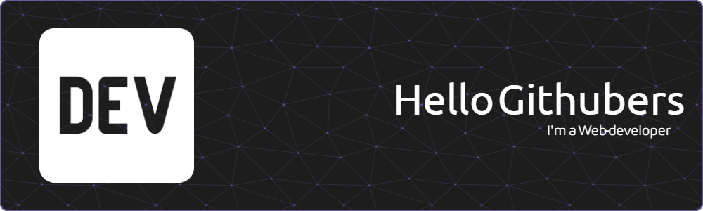

My name is Alex Avetisov, I am a beginner Web Developer. I started learning programming in 2021 and have been trying to learn more and more new things ever since.

<h1 style="text-align: center;">🔧 Technologies & Tools</h1>

<h2>Used OS:</h2>

<h2>Code Editors:</h2>

<h2>Tools:</h2>

<h2>Programming Languages:</h2>

Currently Learning:

<h1 style="text-align: center;">📊 Github Stats</h1>

<h1 style="text-align: center;">Links</h1>

Telegram: 

Discord: 

Gmail: 